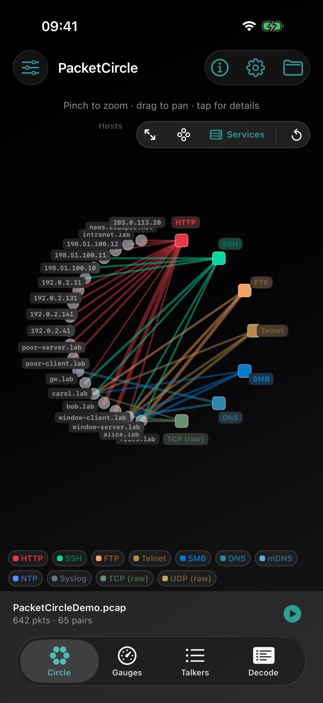

# PacketCircle Native Docs

  

PacketCircle Native provides a native **iOS + macOS** UI for exploring network communication pairs from PCAP/PCAPNG captures. It is inspired by (and conceptually evolved from) the original open-source [PacketCircle Wireshark plugin](https://github.com/netwho/PacketCircle).

**PacketCircle is not a mobile Wireshark.** It contains **no open-source Wireshark / libwireshark dissection**. Decodes are native and limited: you get reasonable IP and TCP detail and some application-layer recognition, but they are **not comparable** to Wireshark’s dissectors.

  

<em>Services view — hosts on the left, applications on the right, edges colored by protocol.</em>

**Free to use** · **not GPL / not open source** — see [License](./docs/LICENSE.md).  
We do **not** collect ANY data — see [Privacy](./docs/PRIVACY.md).

## Docs

### iOS
- **[User Manual](./docs/ios/USER-MANUAL.md)** — background, functions, options, workflows, and current Simulator screenshots
- [Quickstart](./docs/ios/QUICKSTART.md)
- [Detailed usage](./docs/ios/DETAILED-USAGE.md) — representations, analyst workflows, Talkers multi-select
- [Limitations](./docs/ios/LIMITATIONS.md)
- **[1.1.0 notes](./docs/ios/KNOWN-ISSUES-1.0.0.md)** — conversation UX, Gauges quality panels, host names, decode depth

> iOS **1.1.0** continues the conversation-first triage story (App Store availability depends on review timing).

### macOS
- [Quickstart (teaser)](./docs/macos/QUICKSTART.md)
- [Detailed usage (teaser)](./docs/macos/DETAILED-USAGE.md)
- [Limitations (teaser)](./docs/macos/LIMITATIONS.md)

> **Coming soon:** macOS code is not yet available publicly — keep checking back.

### Legal
- [License](./docs/LICENSE.md)
- [Privacy Policy](./docs/PRIVACY.md)

---

*Made with love for the packet community.*
