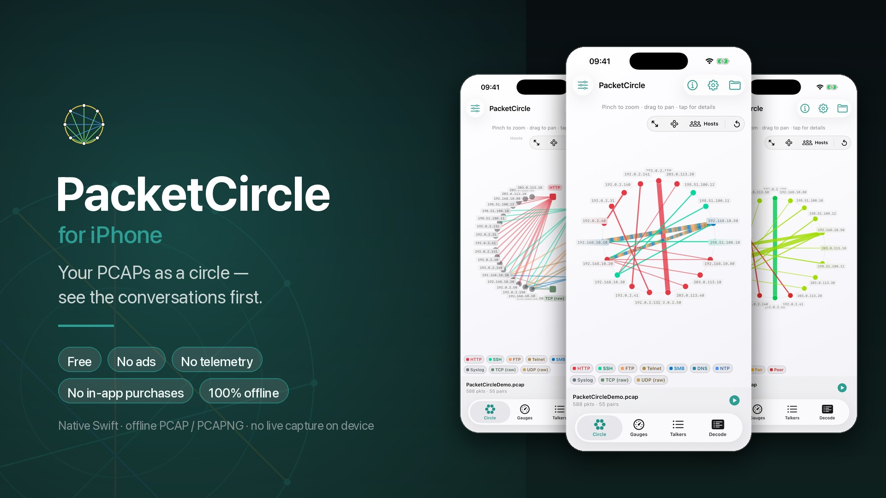
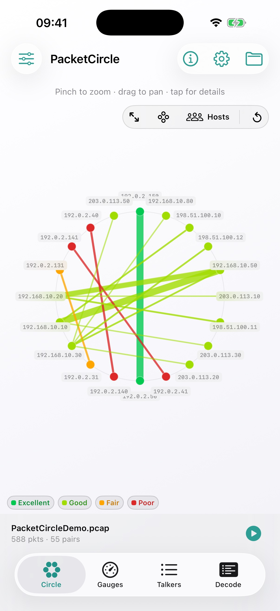
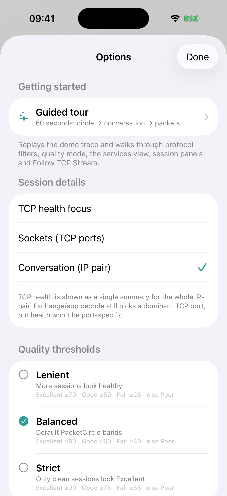
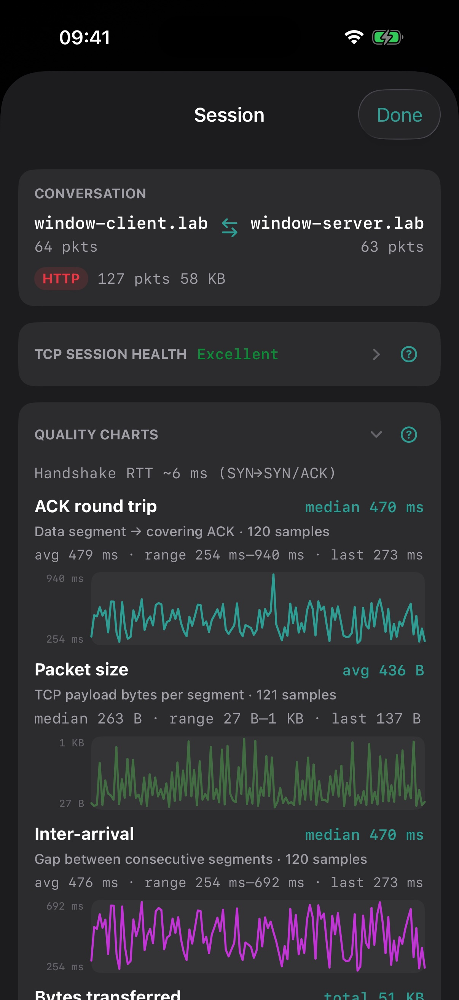
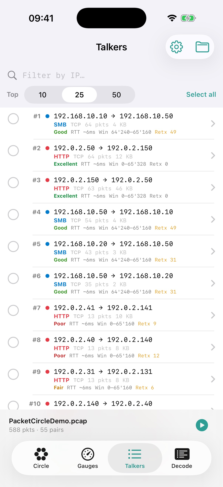

# LinkedIn article draft — PacketCircle for iPhone

  

> **Cover image:** `docs/assets/linkedin-banner.jpg` — 1920 × 1080 (LinkedIn's recommended article cover size). Upload it as the article cover when publishing.  
> **Status:** Draft for LinkedIn (release-candidate voice — personal, a little nerdy, honest).  
> **Images:** The screenshots below render here on GitHub from `docs/assets/` (iPhone Simulator captures). LinkedIn cannot embed GitHub paths — upload the same files manually at each matching spot when publishing.  
> **Tone:** Walter's story → the deal → what it does → use cases → what's next. Cut freely if it runs long for your feed.

---

## Suggested title options

1. I have a thing for circles — so I put a packet analyzer on my iPhone  
2. PacketCircle for iPhone: your PCAPs as a circle, in your pocket, for free  
3. From a Wireshark plugin to a native Swift iPhone app (and everything I learned saying "no" to live capture)

**Suggested subtitle / first line:**  
Native Swift. Offline PCAP/PCAPNG. No ads, no subscriptions, no telemetry — and yes, no live sniffing (I'll explain why).

---

## Article body

  

### It (still) starts with a circle

I have a mildly unreasonable love for one idea: draw network conversations as a **circle**. Who talks to whom, which protocols, which edges run hot. Last year ago that turned into **[PacketCircle](https://github.com/netwho/PacketCircle)**, an open-source **Wireshark plugin**. The mental model never let go of me — once you *see* traffic as a ring of relationships, packet lists feel like reading a phone book to find a party.

So this is less "startup" and more "the itch came back." I wanted the circle on the one screen that's always in my pocket.

### The confession up front: this is a learning project

I'm not a "real" developer. I pay the bills as a consultant, and I've had an Apple Developer account for *years* — used almost entirely to wrap and sign other people's apps for MAM/MDM distribution. Never to actually **build** something. PacketCircle for iPhone was my excuse to finally get my hands dirty with **Xcode**, **Swift** and **SwiftUI**.

And like most of my side projects: **yes, this one is AI-assisted.** I built it with **Cursor** riding shotgun. I'm not going to be coy about it — the interesting part wasn't typing every line, it was deciding what the thing should *be* and where to draw the boundaries. More on those boundaries below.

  

### The deal (this is the part I actually care about)

Because I'm tired of opening the App Store and finding a flashlight that wants a subscription and my location data, here's the whole contract for PacketCircle on iPhone:

- **Free.** Not "free trial." Free.
- **No ads.**
- **No in-app purchases.** Nothing is locked behind a paywall.
- **No telemetry.** I don't phone home. I don't want your data — honestly, keeping it would just be a liability.
- **100% offline.** Put PCAPs in your iPhone storage (Files / AirDrop / share sheet) and it works with the network turned off entirely.

Why free? The honest answer: I don't need PacketCircle to pay rent — consulting does that. The slightly grumpier answer: the App Store is drowning in subscriptions, ad SDKs and data lakes, and I wanted to drop one small thing into it that's just… a tool. If it saves you ten minutes, **buy me a coffee and send good karma — I'm good.** ☕

### Why the App Store at all (and why there's no open-source inside)

For an iPhone app that normal humans can actually install, the **App Store is basically the only reasonable door.** Sideloading and enterprise tricks aren't a real distribution story for a tool like this. So App Store it is — which shaped two decisions:

1. **No live capture on iOS.** You can't sniff the Wi‑Fi/interface from a sandboxed App Store app, and the VPN/tunnel "cheats" people whisper about won't survive review anyway. Rather than fight it, PacketCircle is honest: it's an **offline analyzer** for captures you already have.
2. **No open-source dissection code shipped.** The original plugin lives in GPL land. Mixing **GPL v2 with App Store distribution** is a famous legal rabbit hole, and I'll admit it plainly: **I haven't chased down every detail.** So instead of guessing, I removed the temptation entirely — no libwiretap, no borrowed GPL dissectors. The iOS app is **clean, native Swift** end to end. Less code coverage than Wireshark, sure, but zero license landmines.

The upside of that constraint: the decodes are mine, they're limited on purpose, and I can put them on the Store with a clear conscience.

  
  
  

### What it actually does today

Load a capture, and PacketCircle turns it into a **circle** of talkers you can poke at with your thumb: tap a node or an edge, filter by the legend chips, then drill into **session health**, skim a **decode** tree, or **follow a TCP stream** — all on the phone.

Two switches on the circle change what you're *looking for*:

- **Color → Protocol** paints edges by application (HTTP, SSH, DNS…). Good for “who talks which language.”
- **Color → Quality** paints the *same* host nodes by native TCP session health — Excellent / Good / Fair / Poor. Sick conversations light up red without opening Wireshark. The legend chips become grade filters, so you can solo Poor and hide the noise.
- **Hosts vs Services** rearranges the ring: hosts around the rim (node-to-node), or hosts on one side and service ports on the other (who speaks HTTP/SSH/…).

No file handy? There's a **built-in demo** capture that replays as a one-minute loop so you can see the whole thing move without a lab network.

---

### The 2-minute tour

1. **Open** a capture or hit **Demo Mode**.  
2. Play in the **Circle**: tap nodes/edges; flip **Color** between Protocol and Quality; use the legend chips as filter. Hosts vs Services rearranges the ring.  
3. Peek at **Gauges** for rates and top talkers/protocols.  
4. Browse **Talkers** for the conversation list, or **Decode** for frames + details/hex.  
5. Open **Session details** for TCP health, the exchange ladder, and app decode.  
6. **Follow TCP Stream** when you want the reassembled payload (ASCII/hex) — with a budget so your phone doesn't melt on a 2 GB elephant.  
7. Tap the **status bar** (filename · packets · pairs) to **replay** with original timing.  
8. Open the **ⓘ About** and the **Options** gear for the guided tour, quality bands, IP-pair vs TCP-socket focus, and the stream budget.

  
  
  

---

### Feature list (v1)

| Area | What you get |
|------|----------------|
| **Open** | PCAP / PCAPNG from Files / share sheet — fully offline |
| **Demo** | Bundled demo capture, ~1‑minute loop, replayable |
| **Circle** | Conversation graph; Protocol *or* Quality edge colors; Hosts / Services layout; Top‑N focus |
| **Gauges** | Packet/byte/error rates, top talkers & protocols |
| **Talkers** | Conversation list |
| **Decode** | Packet list, details tree, hex/ASCII (capped frames) |
| **Session details** | Pair summary + native TCP session-health score & metrics |
| **TCP exchange** | Client↔server ladder of segments/ACKs |
| **Application decode** | Lightweight previews (e.g. DNS/HTTP/Telnet) |
| **Follow TCP Stream** | Reassembly, direction filters, ASCII/hex (budget-capped) |
| **Replay** | Tap the status bar → replay with original timing |
| **Guided tour** | 60-second walkthrough from circle → conversation → packets |
| **Privacy** | Everything stays **on device** — no upload, no telemetry, ever |

  
  
  

  
  
  

---

### The use cases that make people lean in

**1. "Just show me who's talking."**  
You grabbed a PCAP off a SPAN/TAP/laptop. On the train home — or mid-meeting — open it on the phone and *see* the conversation map. Flip to **Quality** coloring and the sick pairs light up red (retransmits, RSTs, zero-window, poor score) without leaving the circle. No laptop, no boot time.

**2. Teaching without a lab.**  
Demo Mode is a story told in a circle — HTTP, DNS, SSH, Telnet, SMB, all lit up. Perfect for showing a junior (or a skeptical manager) what "conversation-first" troubleshooting means, without wiring up a network.

**3. The map before the microscope.**  
Use the circle and Talkers to spot the interesting IP pair/port, *then* jump to full Wireshark on a laptop with a proper display filter. PacketCircle finds the needle; Wireshark dissects it.

**4. TCP health triage in your hand.**  
Session details give a **native** health estimate (not Wireshark `tcp.analysis`): window, retransmissions, RST, SYN/FIN, **zero-window** events. Focus **per TCP socket** so one sick HTTPS port can't hide behind a perfectly healthy SSH session on the same IP pair.

**5. Payload peek, no laptop required.**  
Follow TCP Stream for Telnet/HTTP-ish text with client/server coloring. The caps are deliberate — a phone isn't a workstation — and Options lets you raise the budget when you mean it.

**6. Customer site / air-gapped, guilt-free.**  
No cloud account, no "upload your customer's PCAP to our servers." Open locally, analyze locally, delete when done. What happens on the phone stays on the phone.

---

### What it is honestly *not*

- **Not** a replacement for Wireshark's full dissector tree — the decodes are native and intentionally lightweight.  
- **Not** a live Wi‑Fi sniffer on iPhone. See above; I'm not fighting Apple review.  
- **Not** a mobile clone of the plugin — different codebase, different (smaller) coverage, nicer touch UI.  
- **Not** open source on iOS — clean-room native Swift, precisely so it *can* live on the Store.

---

### For the curious / future dev

A few questions I already know you'll ask:

- **"Is there a Mac version?"** Yes — thanks to Swift/SwiftUI sharing the core, a **macOS** build already runs on my machine. It's still catching up in features, so **no release date yet.** It'll show up when it's not embarrassing.
- **"Android?"** No idea yet. I'll at least go find out what it would take — different language, different capture story, different store politics. Consider it "researching," not "promising."
- **"iPad / tablet support?"** Genuinely unsure. The extra screen real estate would suit the circle nicely — but is analyzing PCAPs on a tablet a real workflow for you, or a nice-to-have? **Tell me.** That feedback would actually move it up the list.

---

### Status & links

- **iOS:** heading into **App Store review** — should be live soon.  
- **macOS Native:** private work-in-progress; teaser only.  
- **Docs (public):** https://github.com/netwho/PacketCircle-iOS_macOS-docs  
- **Original Wireshark plugin (GPL):** https://github.com/netwho/PacketCircle  

Built by one packet nerd, for the packet community — with a lot of Cursor and a little obsession with circles.

---

### LinkedIn companion post (selected)

Use this when LinkedIn asks you to share the published article:

> Apple Developer account for years — mostly for wrapping and signing apps for MAM/MDM.  
> This time I finally built something myself.  
> Hint: it’s not hard to guess what it is if you know me and my thing for circles…  
>  
> PacketCircle for iPhone: free, offline, no ads, no subscriptions, no telemetry.  
> Short story about the obsession, the App Store constraints, and why it’s free.

Attach the article link LinkedIn generates when you publish.

---

### Closing line options for LinkedIn

- "A packet analyzer that's free, offline, and doesn't want your data. I know — weird, right?"  
- "I put my favorite way of *seeing* traffic on my phone. Free, no ads, no telemetry. Coffee and good karma accepted. ☕"  
- "Plugin → Swift Mac → Swift iPhone. Same obsession: see the conversations first."

---

## Hashtag suggestions

`#Wireshark` `#PacketAnalysis` `#NetworkEngineering` `#iOS` `#Swift` `#SwiftUI` `#CyberSecurity` `#NetOps` `#PacketCircle` `#IndieDev` `#BuiltWithAI`

## Publishing checklist

- [ ] Set `linkedin-banner.jpg` (1920 × 1080) as the article cover image  
- [ ] Paste title + body into a LinkedIn Article (or long post)  
- [ ] Share with the companion post below (or paste it when LinkedIn asks)  
- [ ] Upload the screenshots from `docs/assets/` at each matching spot (order above works well)  
- [ ] Link docs + plugin repos  
- [ ] Say "App Store review / coming soon"  
- [ ] Keep the AI-assist line — it's honest and it's on-brand  
- [ ] Proof names: PacketCircle, PCAP/PCAPNG, Xcode, SwiftUI, Cursor  
- [ ] Optional: add a coffee/ko-fi link next to the "buy me a coffee" line
