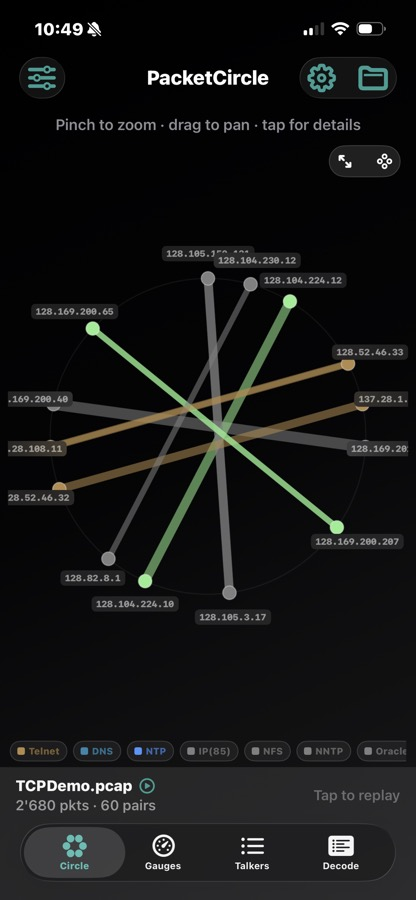
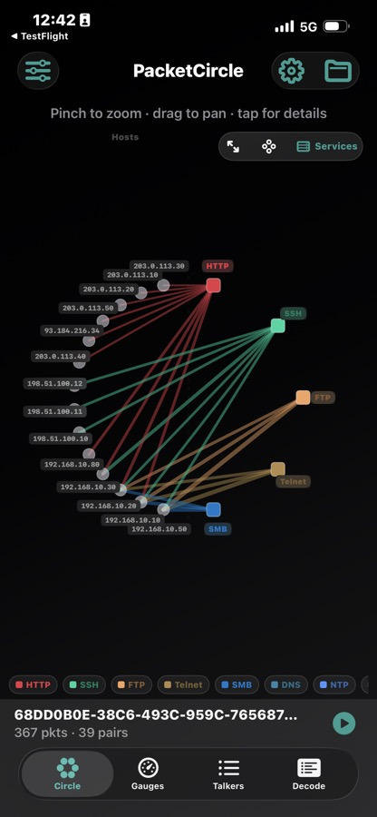
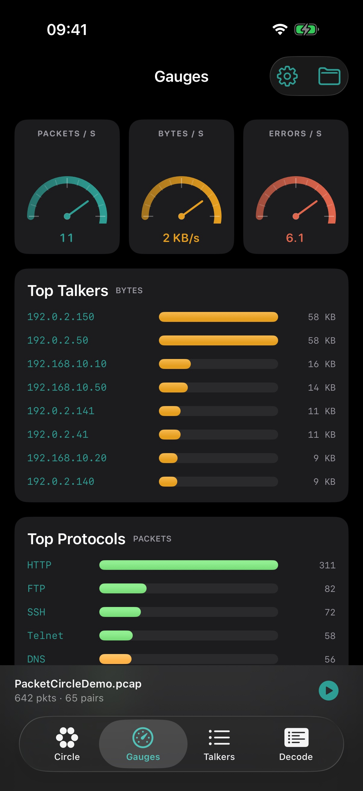
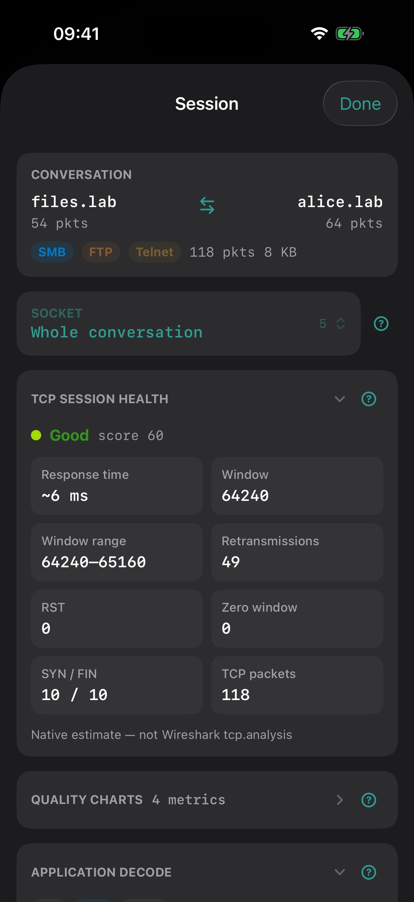
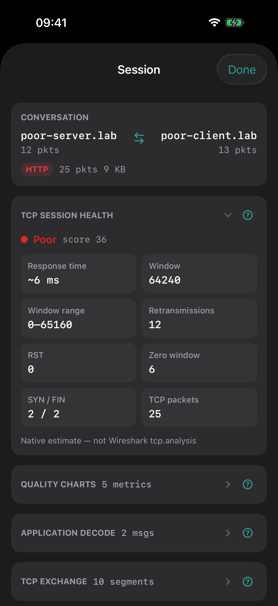
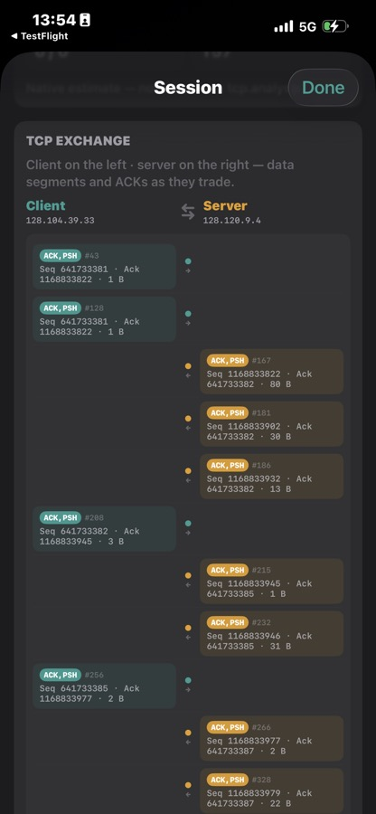
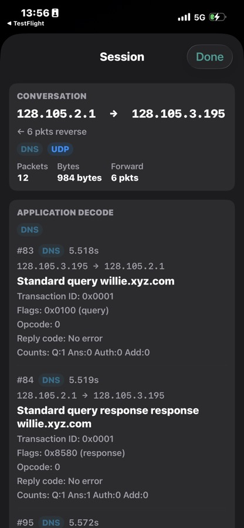
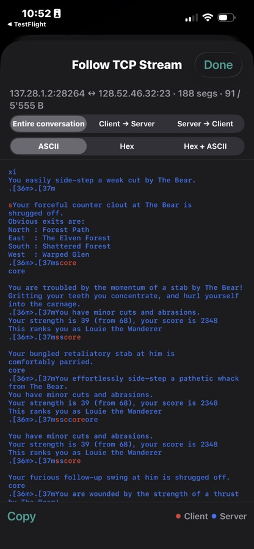
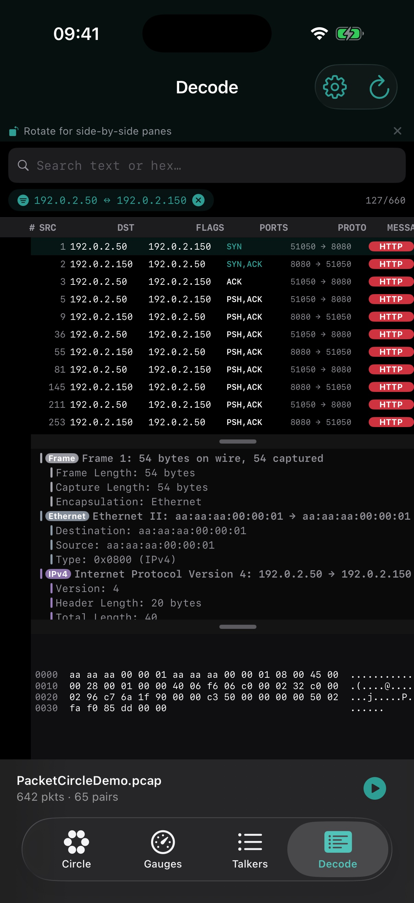

# PacketCircle iOS: Detailed Usage

  

> **Disclaimer:** the iOS release is currently under review by the Apple App Store and should be available soon.

> For the current build walkthrough with fresh Simulator screenshots, see the **[User Manual](USER-MANUAL.md)**.

PacketCircle is built for **conversation-first** packet analysis: see who talks to whom, which services matter, where TCP health degrades, then drill into decode and payload when needed — all offline from PCAP / PCAPNG.

This guide explains the **representations**, **controls**, and **analyst workflows** behind each tab.

## Screenshots

| Hosts circle | Services map | Gauges |
|:---:|:---:|:---:|
|  |  |  |

| Session overview | TCP health | TCP exchange |
|:---:|:---:|:---:|
|  |  |  |

| Application decode | Follow TCP Stream | Decode / Options |
|:---:|:---:|:---:|
|  |  |  |

---

## Analyst mental model

Think in layers:

1. **Topology** — Circle (Hosts or Services) answers *structure*: who connects, which apps dominate.
2. **Volume & health** — Gauges + edge coloring answer *intensity* and *pain*.
3. **Ranking** — Talkers answers *priority*: Top‑N pairs by packets or bytes.
4. **Session** — Session Details answers *why this pair looks odd* (RTT, window, retrans, RST, TLS/ICMP cues).
5. **Evidence** — Decode / Follow TCP Stream answers *what was said* (frames, hex, reassembled payload).

Open Capture always analyzes the **full** file into aggregates. Demo / Replay adds time so you can watch the story unfold.

---

## Circle — two representations

Toggle **Hosts** / **Services** (top-right chip on the Circle tab). Both use the same Top‑N conversations and legend filters; they answer different questions.

### Hosts mode (classic ring)

| Visual | Meaning for the analyst |
|--------|-------------------------|
| **Nodes on the ring** | Unique endpoints (IP or MAC, depending on analysis mode) |
| **Chord / edge** | A conversation pair (undirected host↔host) |
| **Edge thickness** | Relative volume (packets or bytes — Weight in the view menu) |
| **Edge color · Protocol** | Dominant / display protocol for that pair |
| **Edge color · Quality** | TCP session grade (Excellent → Poor); MAC mode stays protocol-colored |
| **Legend chips** | Solo/multi filter by protocol (and related category/grade filters) |
| **Top N** | Only the heaviest pairs are drawn — reduces hairballs |

**Use when:** you care about *host communities*, east–west chatter, or a single host fan-out to many peers.

**Gestures:** pinch to zoom · drag to pan · tap an edge for the connection card · tap a node to highlight its neighborhood.

### Services mode (bipartite host → service)

| Visual | Meaning for the analyst |
|--------|-------------------------|
| **Left arc (hosts)** | Endpoints that originate / participate in service traffic |
| **Right column (services)** | Application / service labels (HTTP, SSH, FTP, Telnet, SMB, DNS, …) |
| **Edges** | Only **host → service** links (no host↔host chords) |
| **Service color** | Stable protocol palette (matches legend) |
| **Fan-in / fan-out** | Many hosts → one service = popular app; one host → many services = multi-role station |

**Use when:** you care about *what was spoken*, service exposure, or “which hosts touched cleartext Telnet / FTP?” without drowning in peer-to-peer chords.

> Tip: solo a legend chip (e.g. **SMB**) in either mode to reduce noise before opening Session Details.

---

## Gauges — rates and rankings

Gauges summarize the capture (and live Demo / Replay ticks) as:

- **Packet / byte / error-style rate** strips over a short rolling history  
- **Top talkers** by bytes and by packets  
- **Top protocols** by share  

**Use when:** you need a dashboard answer — “is this capture bursty?”, “which pair owns the bytes?”, “is DNS drowning the rest?” — before committing to a deep dive.

Tap into gauge detail rows when available to jump toward the same conversations you would find under Talkers.

---

## Talkers — ranked conversations

Talkers is the **ordered work queue** for analysts.

| Control | Behavior |
|---------|----------|
| **#1 … #N** | Rank inside the current Top‑N (by packets or bytes, matching Weight) |
| **Top 10 / 25 / 50** | How many pairs appear in Circle + Talkers |
| **IP filter** | Narrow the list without re-analyzing the file |
| **Checkbox** | Multi-select conversations |
| **Select all / Clear** | Bulk selection helpers |

### When anything is checked

A bottom action bar appears:

| Action | Analyst value |
|--------|----------------|
| **Copy Filter** | Wireshark display filter — OR of selected host pairs (paste into Wireshark / other tools) |
| **Show in Decode** | Opens Decode scoped to the selection (multi-pair OR scope) |
| **Save PCAP** | Exports a new PCAP containing only frames that match the selected conversations |

Tap the row (not the checkbox) to open **Session Details**. Context menus still offer single-pair Copy Filter / Show in Decode.

**Use when:** you have already spotted candidates on the Circle and want to batch-export or batch-decode the interesting subset.

---

## Session Details — per-conversation deep dive

Opened from Circle (edge / card) or Talkers. Layout adapts to what the pair actually carries.

### TCP Session Health

Native estimate (not Wireshark `tcp.analysis`), scored 0–100 then graded Excellent / Good / Fair / Poor using Options thresholds.

Typical signals:

- RTT estimate  
- Window min/max (and zero-window counts)  
- Retransmission guesses  
- RST / SYN / FIN presence  
- Grade color (same palette as Quality edge mode)

**Conversation vs Sockets focus (Options):**

- **Conversation** — one health summary for the IP pair (all TCP ports rolled up)  
- **Sockets** — pick a destination TCP port / service; health is port-specific  

Use **Sockets** when one IP pair multiplexes HTTP + SSH + something sick, and only one service is misbehaving.

### TCP Exchange

Client ↔ server ladder of segments (flags, seq/ack, payload lengths). Paginated (**20** rows, then **Show more**) so phones stay usable.

### Application decode / messages

Protocol-aware previews where PacketCircle can summarize them, for example:

- DNS / HTTP / SMB / mail / FTP / Telnet / Kerberos / LDAP / SSH snippets  
- **TLS** card when certificates / SNI are visible (TLS 1.3 often SNI-only)  
- **ICMP / ICMPv6 / ARP** message lists when that is the conversation’s layer  

Rows are paginated; use **Show in Decode** for the full capped frame list.

### Follow TCP Stream

From Session Details (TCP pairs): reassembled payload with:

- Directions: Entire / Client→Server / Server→Client  
- Formats: ASCII / Hex / Hex+ASCII  
- **Client = red · Server = blue**  
- Budget capped in Options (default **256 KB**, range **64–2048 KB**)  

Without a clear SYN handshake, client/server uses a well-known-port heuristic.

---

## Decode — frame list + hex

Decode shows a **capped** frame list (Options: **500–10 000**, default **5 000**) with detail tree and hex pane.

| Scope | How you get there |
|-------|-------------------|
| Whole capture (capped) | Open Decode tab with no conversation scope |
| One pair (+ optional port) | Session Details → Show in Decode |
| Several pairs | Talkers multi-select → Show in Decode |

Free-text / hex search further narrows the list. Prefer scoped Decode on large files — it keeps the list about *this* incident.

---

## Open, Demo, and Replay

| Path | What happens |
|------|----------------|
| **Open Capture** | Full offline analyze → aggregates for Circle / Gauges / Talkers |
| **Demo Mode** | Built-in (or small) story, timed loop — great for teaching the UI |
| **Stop Demo** | Finishes into a normal full analyze of that demo capture |
| **Replay** (status bar) | Re-walks the loaded file at original inter-frame timing |

Status bar shows roughly: `<file> · <packets> · <pairs>` and offers Replay when a file is loaded.

---

## Options (gear)

| Setting | Effect |
|---------|--------|
| **TCP health focus** | Conversation vs Sockets (see Session Details) |
| **Quality thresholds** | Lenient / Balanced / Strict — remaps the same 0–100 score into grade bands (color only) |
| **Follow TCP Stream budget** | Caps reassembly + scan so huge streams don’t freeze the UI |
| **Decode frame limit** | Caps how many frames Decode materializes |

Also available from the Circle view menu: **IP vs MAC** analysis mode, **Packets vs Bytes** weight, **Top N**, **Protocol vs Quality** edge coloring.

---

## Suggested workflows

### “What is this capture about?”

1. Open → glance **Gauges** (top protocols / talkers)  
2. **Circle · Services** — which apps appear, who fans into them  
3. Solo noisy protocols off the legend if needed  

### “Find the sick TCP session”

1. Circle menu → Color **Quality**  
2. Spot Poor / Fair edges → open Session Details  
3. If the pair hosts several ports, switch Options to **Sockets** and isolate the bad service  
4. Follow TCP Stream or Show in Decode for evidence  

### “Export just the interesting talkers”

1. Talkers → set Top N → check the ranked rows you care about  
2. **Save PCAP** for a shareable subset, and/or **Copy Filter** for Wireshark  

### “Cleartext / legacy service exposure”

1. Circle · **Services**  
2. Focus Telnet / FTP / HTTP (cleartext) via legend  
3. Open host→service edges → Follow Stream for commands and banners  

---

## Related

- [Quickstart](./QUICKSTART.md) — shortest path from open → explore  
- [Limitations](./LIMITATIONS.md) — memory, caps, and comfort-zone file sizes  
