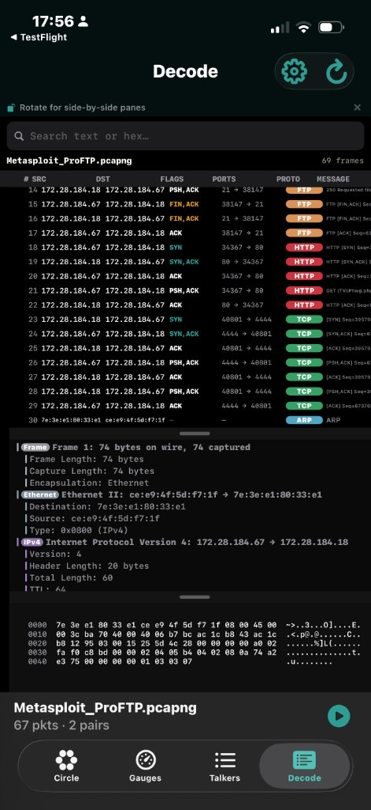
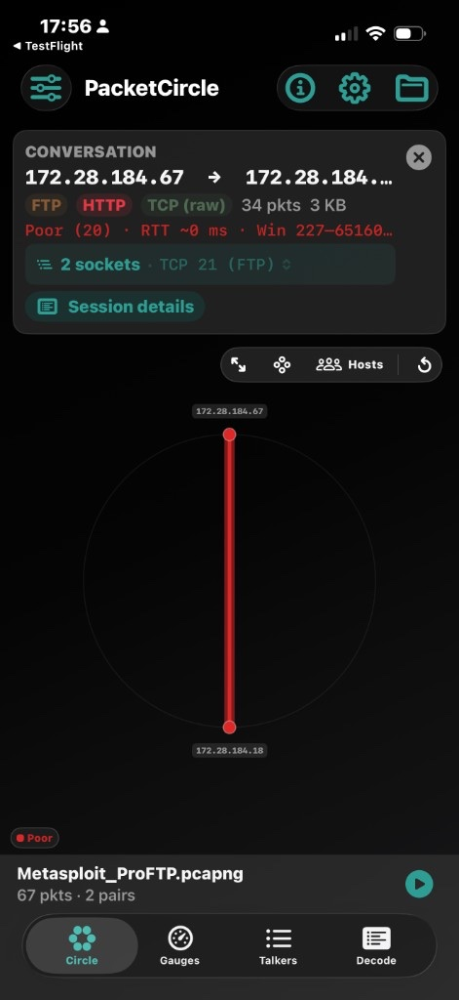

# PacketCircle iOS — Known issues (1.0.0) & plans (1.1.0)

<p align="center">
  
</p>

**Status:** iOS **1.0.0** is in App Store review. This page lists known limitations shipping with 1.0.0 and the intended **1.1.0** work. None of the items below are treated as App Store show-stoppers — 1.0.0 remains useful for conversation-first triage; 1.1.0 tightens fidelity and UX.

| Version | Intent |
|---------|--------|
| **1.0.0** | First App Store release (under review) |
| **1.1.0** | Fixes below + Gauges feature (error/window table + quality timeline) |

---

## Known issues in 1.0.0

### KI-1 — Unnamed / backchannel TCP ports under-represented on Circle & Talkers

**Example:** Metasploit-style FTP exploit capture (`Metasploit_ProFTP.pcapng`): FTP on **21**, HTTP on **80**, backchannel on **4444**.

| View | What you see today |
|------|--------------------|
| **Decode** | Port **4444** frames are present and labeled as generic **TCP** (handshake + data). |
| **Circle / Talkers** | The IP pair may show a **TCP (raw)** chip in some layouts, but the **4444** socket is easy to miss — conversation / socket summaries often emphasize well-known services (e.g. “TCP 21 (FTP)”) and do not make the backchannel port obvious. |

Decode (4444 visible as TCP):

<p align="center">
  
</p>

Circle conversation summary (FTP / HTTP / TCP (raw); socket line still centers on port 21):

<p align="center">
  
</p>

**Impact:** Exploit / lab backchannels and other non-well-known listeners are easy to find in Decode, harder to spot in the conversation-first views that 1.0.0 is meant for.

**Planned fix:** 1.1.0 — see [FIX-1](#fix-1--surface-unnamed-tcpudp-ports-on-circle--talkers).

---

### KI-2 — Talkers rows omit port numbers

Talkers shows IP pair, protocol badges, packet/byte counts, and quality hints, but **not the TCP/UDP ports** in use. There is room on the row; without ports you often open Session just to learn *which* sockets belong to the conversation.

**Planned fix:** 1.1.0 — [FIX-2](#fix-2--show-ports-on-talkers-rows).

---

### KI-3 — Conversation summary is one-way and light on ports

Conversation / pair summary panels (Circle selection card, and related session headers) currently:

- Use a **one-directional** `A → B` arrow even though aggregates are **bi-directional** (reverse packet counts appear elsewhere).
- Do not put **per-side packets and ports** next to each address at a glance — you browse into Application decode / sockets to confirm.

**Planned fix:** 1.1.0 — [FIX-3](#fix-3--bi-directional-conversation-summary-layout).

---

### KI-4 — Conversation “summary” panels are not fully consistent across modes

Circle Hosts / Services / Protocol / Quality, Talkers, Session, and Gauges drill-downs each summarize a pair slightly differently (chips, socket line, quality string, arrow direction). Most combinations work; a few omit ports or look one-way when the rest of the UI is conversation-oriented.

**Planned fix:** 1.1.0 — [FIX-4](#fix-4--audit-conversation-summary-panels).

---

### KI-5 — Guided tour leaves filters / view state behind

After the guided tour, the circle can still carry tour-driven filters, selections, or layout choices. The next manual exploration is not always a clean desk.

**Planned fix:** 1.1.0 — [FIX-5](#fix-5--guided-tour-ends-on-a-clean-circle).

---

### KI-6 — Talkers Top‑N can hide pairs that analysis already has

Talkers can feel capped like the Circle Top‑N (**10 / 25 / 50**). For triage, **Talkers should list all analyzed conversations**; Circle keeps the Top‑N drawing budget for readability.

**Planned fix:** 1.1.0 — [FIX-6](#fix-6--talkers-shows-all-pairs-circle-keeps-top-n).

---

### Other 1.0.0 notes (minor / already documented)

| Note | Detail |
|------|--------|
| Decode frame count vs status bar | Decode may show a capped frame list count (e.g. “69 frames”) while the file bar reports analyzed packets (e.g. “67 pkts”) — different scopes, can look inconsistent. |
| Follow TCP Stream budget | Reassembly is Options-capped; large streams truncate by design ([Limitations](./LIMITATIONS.md)). |
| Native decode depth | Not Wireshark-class; unnamed ports stay “TCP” / “UDP” / **TCP (raw)** / **UDP (raw)** until classified. |
| No live capture on iOS | Offline PCAP/PCAPNG only ([Privacy](../PRIVACY.md)). |
| Practical file size | Day-to-day ~11 MB is comfortable; larger files often work; Follow is the usual wait ([Limitations](./LIMITATIONS.md)). |

---

## Planned for 1.1.0 — Fixes

### FIX-1 — Surface unnamed TCP/UDP ports on Circle & Talkers

- Treat backchannels (e.g. **4444**) as first-class sockets on the IP pair, not only as Decode rows.
- Ensure **TCP (raw)** / **UDP (raw)** (and port lists) appear consistently wherever protocol chips and socket pickers are shown.
- Verify with exploit / lab traces that mix well-known services + listener ports on the same pair.

### FIX-2 — Show ports on Talkers rows

- Add compact port / socket hints on each Talkers row (space is available).
- Keep quality + protocol badges; ports should not require opening Session.

### FIX-3 — Bi-directional conversation summary layout

Realign conversation summary cards roughly as:

```
Node A address          ⟷          Node B address
Pkts sent (A→B)                    Pkts sent (B→A)
Port(s)                            Port(s)

Total packets · total bytes
[ protocol chips … ]
```

- Arrow is **bi-directional** (`⟷` / equivalent) — matches the rest of the conversation model.
- Left / right columns for the two endpoints.
- Totals + protocol labels **below** the two-column block (not forced into the table).
- Open to better visual packing on narrow phones; goal is “ports + both directions without scrolling into app decode.”

Also show the **port pair / sockets** prominently in Conversation / Session details headers (not only deeper in Application decode).

### FIX-4 — Audit conversation summary panels

Walk every summary surface (Circle selection, Talkers row, Session header, Gauges protocol drill-down, Quality vs Protocol coloring, Hosts vs Services, IP vs MAC / L2 where applicable):

- Same bi-dir semantics where the data is a conversation.
- Ports visible when the use case needs them.
- Fix inconsistencies unless a specific mode genuinely needs a different summary.

### FIX-5 — Guided tour ends on a clean circle

When the tour finishes (or on explicit reset at the end):

- Switch to **Circle**
- Clear filters / selections
- Restore default legend / Top‑N as needed  
→ user starts with a **clean desk**.

### FIX-6 — Talkers shows all pairs; Circle keeps Top‑N

- **Talkers:** list **all** conversations from analysis (with search / sort as today).
- **Circle:** keep **10 / 25 / 50** Top‑N for the ring drawing budget.

---

## Planned for 1.1.0 — Feature

### FEAT-1 — Gauges: problem hosts table + quality timeline

Two new Gauges panels:

1. **Table — top hosts with errors & window range**  
   - Columns oriented around problematic TCP (errors / zero-window / window range, etc.).  
   - **Tap a row → Conversation / Session details** for that pair.

2. **Line chart — quality over capture time**  
   - X-axis = trace duration (scaled).  
   - Series / bands for the four quality grades (**Excellent / Good / Fair / Poor**).  
   - **Tap the timeline** → choose a time slice (± window around the tap).  
   - Slice can be sent as a filter to **Talkers** and/or **Decode** (scoped view of that interval).

---

## Versioning note

| Release | Scope |
|---------|--------|
| **1.0.0** | Ship under review with the known issues above documented. |
| **1.1.0** | FIX-1 … FIX-6 + FEAT-1 (Gauges table + quality timeline). |

Build / marketing version bumps to **1.1.0** when that work lands; this page will be updated when items close.

---

## Feedback

Comments on LinkedIn or issues on this docs repo help prioritize 1.1.0 — especially real captures where unnamed ports or summary panels still mislead.

---

*PacketCircle — conversation-first triage on iPhone.*
