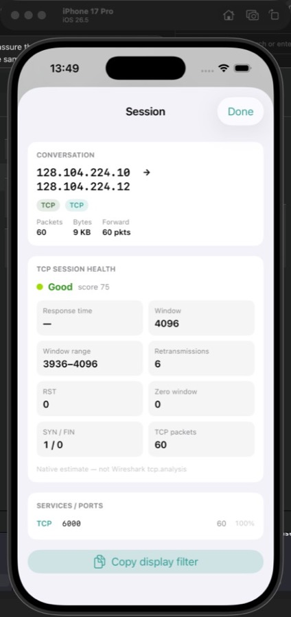

# PacketCircle iOS: Limitations

PacketCircle iOS is designed to be reliable and responsive on mobile devices. Several areas are capped or heuristic-based.

## Performance caps

### Follow TCP Stream truncation

Follow TCP Stream reassembles and displays a capped amount of payload.

- Controlled by **Options -> Follow TCP Stream budget (KB)**.
- When the budget is reached, the displayed stream is truncated.

If a stream is too large, increase the budget carefully (higher values cost CPU and memory).

### Decode list caps

Any decode list view uses a maximum number of frames.

If you need more, filter down the selection (for example by pair and port) and re-open decode.

## Data scope and heuristics

### Session Details TCP health scope

TCP health metrics depend on **Session Details focus**:

- **Conversation (IP pair)**: aggregated across all TCP ports between the two IPs.
- **Sockets (TCP ports)**: port-specific health for the selected TCP port.

If you suspect a slow service, use **Sockets** mode and pick the correct port.

### Client/server detection in Follow TCP Stream

Client/server direction is derived from SYN when available.

If the capture does not include the SYN for that TCP connection, PacketCircle uses a best-effort heuristic (well-known port / port ordering).

## iOS-specific constraints

- No live capture on device (offline PCAP/PCAPNG only).
- Very large captures can feel slow or get memory pressure on older devices.

## Practical recommendations

1. Prefer filtering to a smaller capture when doing deep decode or follow.
2. If Follow TCP Stream truncates too early, raise **Follow TCP Stream budget (KB)**.
3. Use **Sockets (TCP ports)** to pinpoint which port/service is slow.

