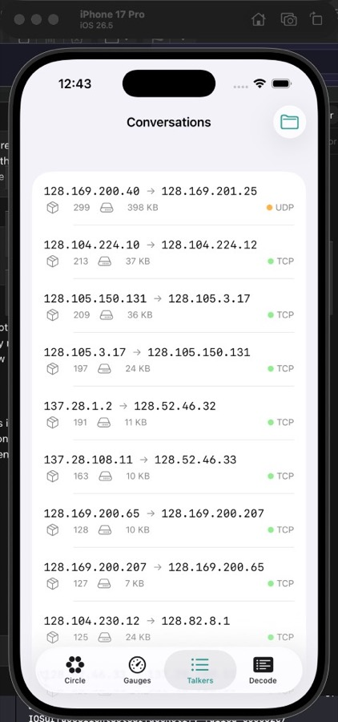

# PacketCircle iOS: Quickstart

PacketCircle iOS is an offline analyzer for PCAP/PCAPNG files. It lets you open a capture, explore communication pairs, and (optionally) follow TCP streams.

> Disclaimer: the iOS release is currently under review by the Apple App Store and should be available soon.  

## Screenshots

## Requirements

- iOS 17+ (runs on-device or Simulator)
- iOS app does **not** support live capture (PCAP only)

## 1) Open a capture

1. Open PacketCircle iOS.
2. Import a `*.pcap` or `*.pcapng` from Files / Share Sheet.
3. The app loads the entire trace (no "partial vs replay" choices at import time).
4. When loading completes, use the bottom status bar to confirm the file and scope:
   - `<file name> · <X pkts> · <Y pairs>`

## 2) Explore communication pairs

- **Circle**: visual map of talkers and communication pairs.
- **Gauges**: high-level traffic and protocol distribution.
- **Conversations**: table-style browsing and selection.

Tip: Use the search to jump to an IP/prefix or a TCP port (for example `TCP 443`).

## 3) Replay original timing (optional)

The default open is "load full trace".

To replay with original timing:
1. Tap the bottom capture status bar.
2. Confirm "Replay".

## 4) Open session details

Select a pair to open Session Details. If TCP ports are present:
- In **Session Details focus = Sockets (TCP ports)**, you can pick a "TCP socket" (port) and the TCP health metrics will follow that selection.
- In **Session Details focus = Conversation (IP pair)**, you see the aggregated TCP health for the whole IP pair.

## 5) Follow TCP Stream (optional)

Use **Follow TCP Stream** for a single conversation direction (client->server or server->client) and view a capped reassembly.

If the stream feels slow or truncated, open **Options** (gear icon) and adjust:
- **Follow TCP Stream budget (KB)**.

