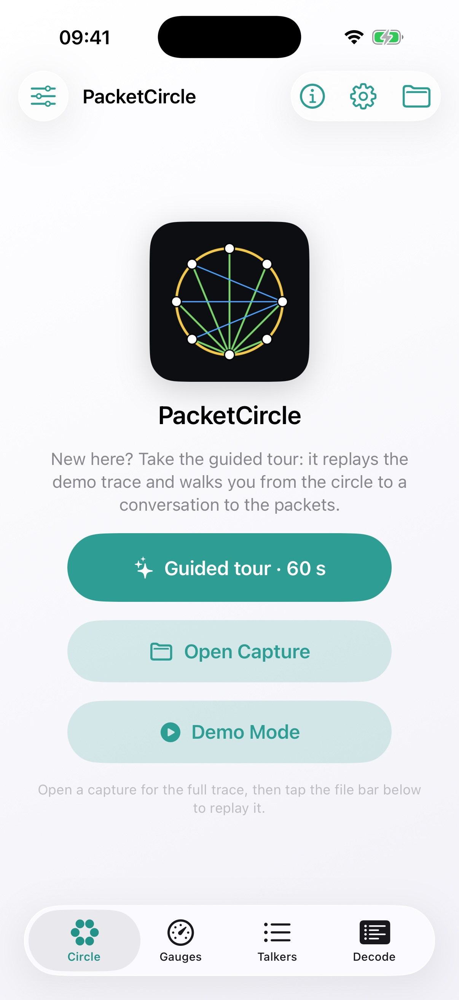

# PacketCircle iOS: Quickstart

  

> **Disclaimer:** the iOS release is currently under review by the Apple App Store and should be available soon.

PacketCircle iOS is an offline analyzer for PCAP/PCAPNG. Open a capture, explore talkers on a **Hosts** ring or a **Services** map, then drill into session health, decode, and Follow TCP Stream.

## Screenshots

| Home | Hosts circle | Services map |
|:---:|:---:|:---:|
|  |  |  |

| Gauges | Follow TCP Stream | Decode |
|:---:|:---:|:---:|
|  |  |  |

## Requirements

- iOS 17+ (device or Simulator)
- Offline PCAP/PCAPNG only — **no live capture** on device

## 1) Open a capture

1. Open PacketCircle iOS.
2. Tap **Open Capture** and pick a `*.pcap` / `*.pcapng` (or use **Demo Mode**).
3. The app loads / analyzes the entire trace.
4. The bottom status bar shows: `<file> · <X pkts> · <Y pairs>`

## 2) Explore

- **Circle** — Hosts ring (who↔whom) or **Services** map (host→HTTP/SSH/…)
- **Gauges** — rates, top talkers, top protocols
- **Talkers** — ranked Top‑N list; check rows to filter / Decode / Save PCAP
- **Decode** — packet list + details / hex

## 3) Replay (optional)

Tap the bottom capture status bar → confirm **Replay** for original timing.

## 4) Session details

Select a pair → **Session details** for TCP health, exchange ladder, application / TLS / ICMP previews.

## 5) Follow TCP Stream

From Session details, open **Follow TCP Stream** for capped ASCII/hex reassembly (client = red, server = blue). Adjust the budget under **Options** (gear) if needed.

## Next

Read **[Detailed usage](./DETAILED-USAGE.md)** for representations, multi-select Talkers workflows, and Options.
