# PacketCircle User Manual

  

*Screenshots from the iOS Simulator against the current Debug build and the built-in demo capture (`PacketCircleDemo.pcap`), captured in **dark mode**.*

---

## 1. Background and motivation

PacketCircle started as ideas from an open-source [Wireshark plugin](https://github.com/netwho/PacketCircle) that drew host-to-host conversations as a circle. The **native Apple apps** (macOS and iOS) take that visualization further: open a PCAP/PCAPNG, see who talks to whom, spot rough TCP health, and drill into a conversation — without shipping Wireshark or a GPL dissection stack inside the product.

### What PacketCircle is

- A **capture visualizer** focused on **conversation topology**, **talkers**, **native TCP session-quality estimates**, and **lightweight decode**.
- A **proprietary** product (see [License](../LICENSE.md)). Analysis and UI are implemented in Swift (`PacketCircleCore` + SwiftUI).
- Useful when you want a **fast, phone-friendly picture** of a trace: pairs, protocols, quality bands, and enough IP/TCP (and some application) detail to reason about a problem.

### What PacketCircle is not

**PacketCircle is not a mobile Wireshark.**

It contains **no open-source Wireshark / libwireshark dissection**. There is no claim of protocol parity with Wireshark’s dissectors, expert infos, or `tcp.analysis` fields. Optional libwiretap linkage exists only for local/dev builds and is **not** used in App Store builds.

Application-layer decode is **best-effort and limited**. You get **reasonable IP and TCP** trees, hex, and **some** app-level recognition (for example HTTP request lines, DNS names, SSH banners, FTP/Telnet ASCII, SMB headers, TLS SNI where detectable). That is often enough to orient a lab or field capture — it is **not** comparable to Wireshark’s depth or accuracy.

For capacity and decode limits, see [Limitations](LIMITATIONS.md).  
For **1.1.0** release notes (and archived 1.0.0 known issues), see [Known issues / 1.1.0 notes](KNOWN-ISSUES-1.0.0.md).

---

## 2. Getting started (iOS)

| Step | Action |
|------|--------|
| 1 | Install / run PacketCircle on iPhone or Simulator. |
| 2 | On first launch, take the **Guided tour**, or open **Options → Guided tour** later (ends on a clean Circle). |
| 3 | Tap the folder control to import a **PCAP** or **PCAPNG**, or use the **demo** sample when the canvas is empty. |
| 4 | Explore **Circle → Talkers / Session → Decode** as needed. |

### Empty canvas

When nothing is loaded, the Circle tab offers a short orientation and a one-tap path into the built-in demo.

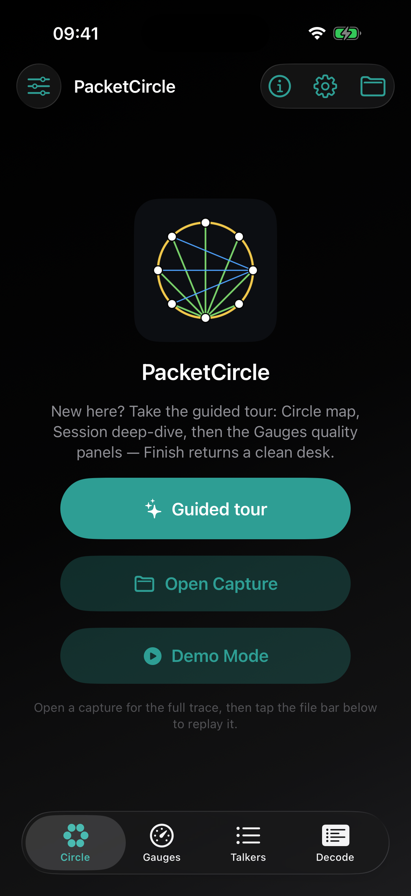

### Live demo loop

**Play** on a loaded file (or start Demo from empty) replays the capture as a short loop so arcs and gauges move. **Stop** returns to the static analysis of the full file.

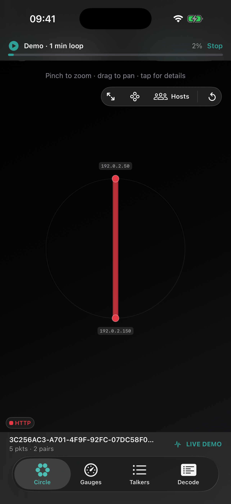

---

## 3. Main screens and functions

### 3.1 Circle

The Circle tab is the primary view: hosts on a ring, edges for conversations, color by **protocol** or **quality**.

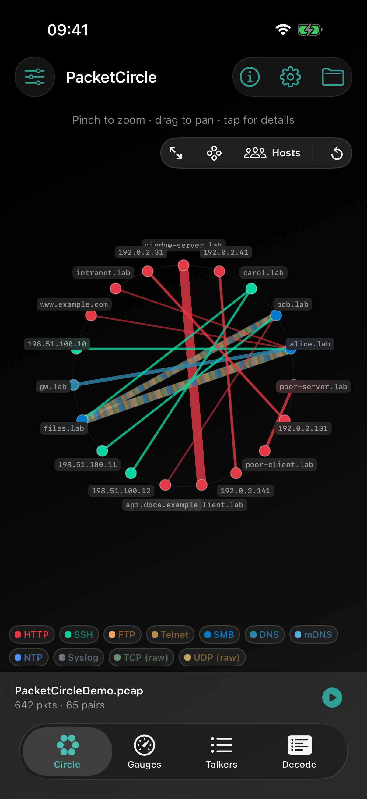

**Gestures**

| Gesture | Effect |
|---------|--------|
| Pinch | Zoom |
| Drag | Pan |
| Tap edge / host | Open session / highlight |
| Legend chip | Filter (solo-then-toggle); reset restores all |

**Toolbar (floating)**

| Control | Role |
|---------|------|
| Expand | More canvas |
| Layout | Host layout mode |
| Hosts / Services | Toggle host-centric vs service-centric layout |
| Reset | Clear zoom/pan (and related view state) |

**Modes**

- **Protocol colors** — edges follow dominant app/transport labels (HTTP, SSH, FTP, …).
- **Quality colors** — Excellent / Good / Fair / Poor from the native TCP score.

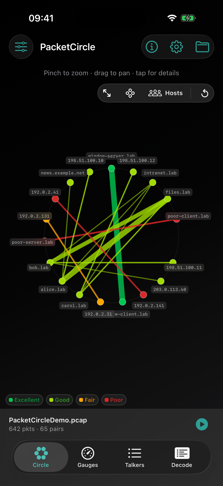

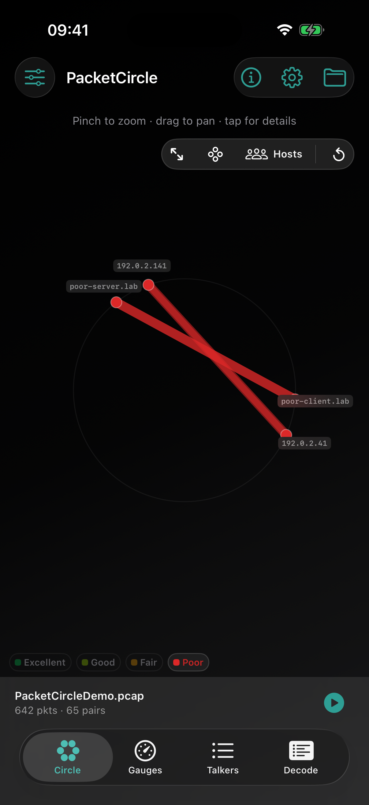

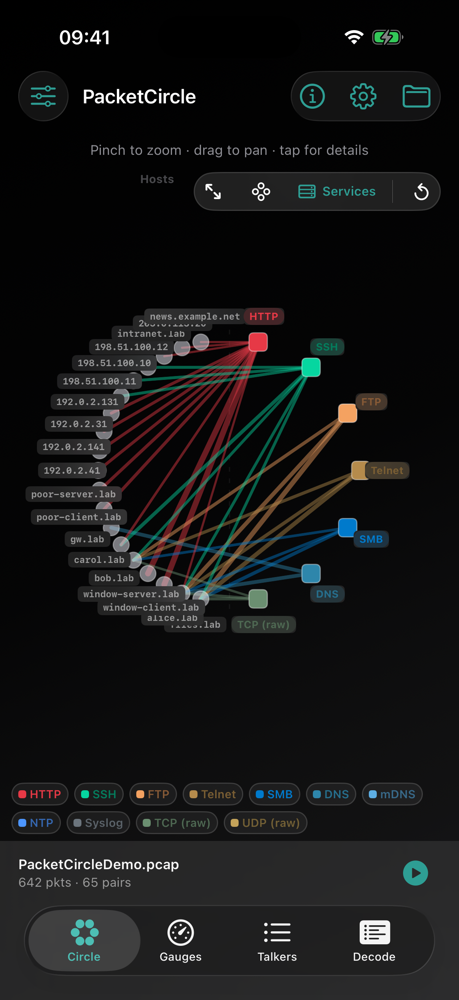

The footer shows the open file name, packet/pair counts, and **Play** for replay.

---

### 3.2 Session details

Tap a conversation to open **Session**: conversation summary, optional **socket** picker, **TCP session health**, quality charts, exchange/app preview, and actions such as **Follow TCP Stream**.

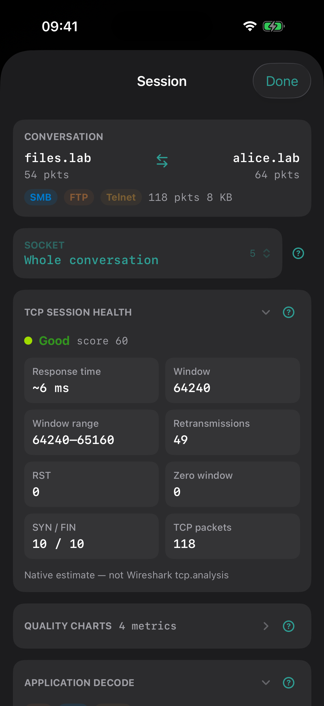

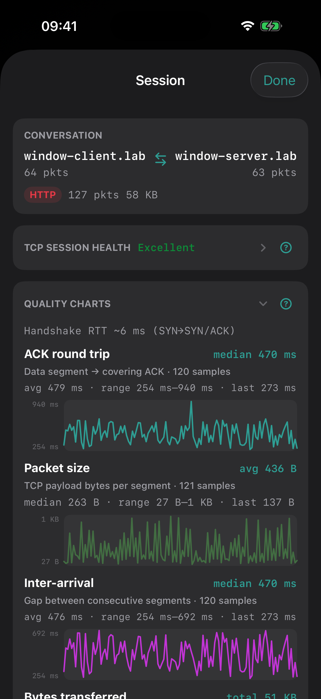

**Panels (collapsible; state remembered)**

| Panel | Contents |
|-------|----------|
| Conversation | Endpoints, protocols, packet/byte counts |
| Socket selector | Whole conversation vs individual TCP ports (when multiple) |
| TCP session health | Grade, score, RTT, window, retransmits, RST, zero-window, SYN/FIN |
| Quality charts | Handshake RTT, ACK RTT, window over time, etc. (with median/avg/range labels) |
| Exchange / app | Lightweight app preview when payloads allow |

Help **(?)** on panels explains each block. Health footers state that scores are a **native estimate — not Wireshark `tcp.analysis`**.

---

### 3.3 Follow TCP Stream

From Session, open **Follow TCP Stream** to reassemble payload bytes for one TCP flow (budget-limited on device).

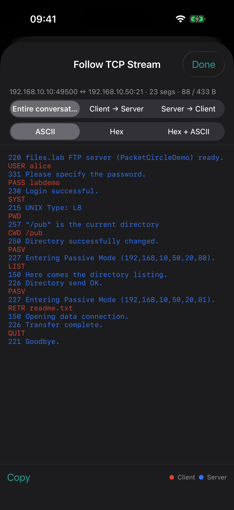

| Control | Options |
|---------|---------|
| Direction | Entire conversation · Client → Server · Server → Client |
| Format | ASCII · Hex · Hex + ASCII |
| Copy | Clipboard |

Client/server coloring is directional, not a full protocol interpreter.

---

### 3.4 Talkers

List of **all** analyzed IP pairs ranked by volume, with a bi-directional summary, protocol chips, quality grade, and TCP hints. Filter by IP; optional time slice from Gauges. Circle Top‑N (**10 / 25 / 50**) does **not** hide Talkers rows. Tap a row for Session.

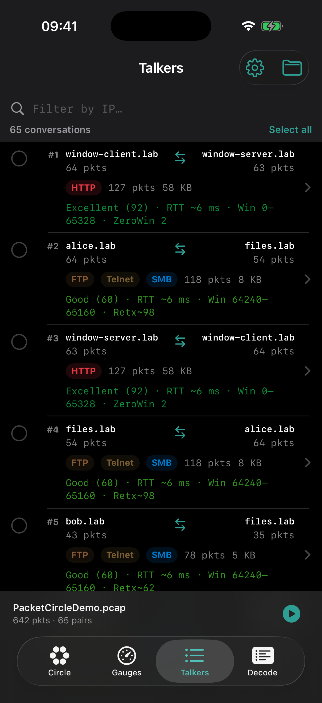

---

### 3.5 Gauges

High-level rates and distributions: packets/s, bytes/s, errors/s, top talkers by bytes, top protocols by packets — plus:

- **Degraded Quality Conversations** (Fair/Poor, worst first) → tap for Session  
- **Quality timeline** → tap for a time slice → Talkers  

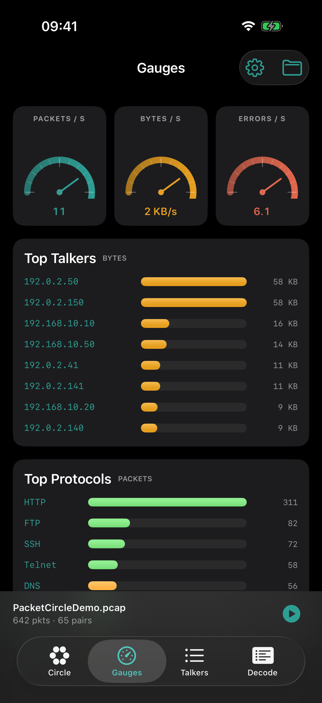

---

### 3.6 Decode

Packet list + protocol tree + hex/ASCII for frames loaded into the Decode budget (default **5 000**; Options can raise to **10 000**). Search text or hex; filters from Circle/Talkers can scope to a pair. Labels prefer readable names over raw opcodes; infra protocols (IPsec, BGP, OSPF, MPLS, VXLAN, NetFlow, LLDP, EAPOL, BPDU, mDNS, …) are best-effort.

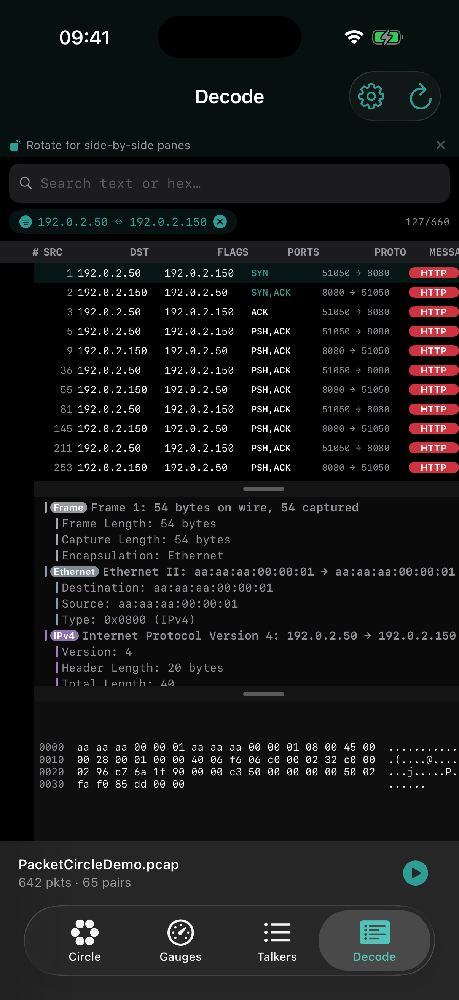

Rotate the phone for side-by-side panes when available. Decode depth is **native** (Ethernet → IP → TCP/UDP → limited app layers), not Wireshark-class.

---

### 3.7 Options

Gear → **Options**.

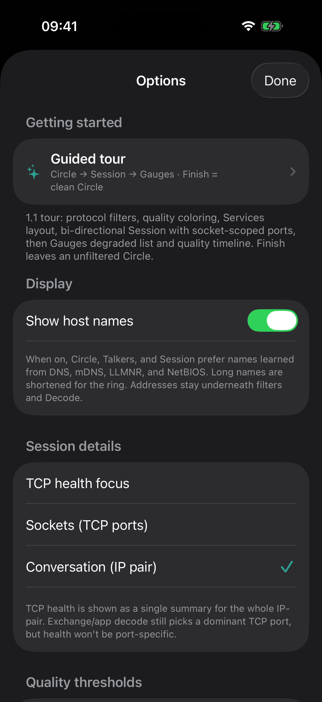

| Setting | Purpose |
|---------|---------|
| **Guided tour** | Demo + coach-marks Circle → Session → Gauges; Finish leaves a clean Circle |
| **TCP health focus** | **Sockets (TCP ports)** — health per selected port · **Conversation (IP pair)** — one summary for the pair |
| **Quality thresholds** | **Lenient** / **Balanced** (default) / **Strict** — how the same 0–100 score maps to Excellent–Poor colors |
| **Show host names** | Prefer shortened DNS / mDNS / LLMNR / NetBIOS names on Circle, Talkers, Session |
| **Follow TCP Stream — reassembly budget** | 64–1024 KB (affects max bytes/segments scanned) |
| **Decode list — max packets** | 500–10 000 frames |
| **How quality is measured** | In-app explanation of RST, retransmit, zero-window, RTT penalties |

---

## 4. Options reference (quick)

### Quality score (0–100)

Starts at 100 for TCP conversations with packets; penalties reduce the score (RST, retransmission rate, zero-window events, slow handshake RTT). Window size and handshake options are shown for context and **do not** change the score. Thresholds only change **color bands**, not the numeric score.

### Session details focus

| Mode | When to use |
|------|-------------|
| Sockets (TCP ports) | Several services between the same two IPs; isolate the slow or broken port |
| Conversation (IP pair) | One health summary for the whole pair |

---

## 5. Workflows

### A. First look at a capture

1. Open the file (or Demo).
2. On **Circle**, skim arcs and the protocol legend.
3. Switch to **quality** coloring; tap **Poor** / **Fair** to solo problem edges.
4. Open **Talkers** for ranked volume, or tap an edge for **Session**.

### B. Diagnose a bad TCP session

1. Quality mode → filter **Poor**, or open **Gauges → Degraded Quality Conversations**.
2. Open **Session** → read health (retransmits, RST, zero-window, RTT).
3. Expand **quality charts** for timing and window behavior.
4. If multiple ports: Options → **Sockets**, then pick the socket in Session (ports appear on the bi-dir summary).
5. Optionally tap the **quality timeline** for a time slice → Talkers.
6. **Follow TCP Stream** or **Decode** (filtered to the pair) for payload/context.

### C. Services view

1. On Circle, switch to **Services** layout when you care about ports/roles more than host identity.
2. Combine with protocol legend filters to isolate one service class.

### D. App-oriented peek (lab / cleartext)

1. Filter legend to HTTP, FTP, Telnet, DNS, etc.
2. Session exchange preview and/or Follow TCP Stream (ASCII).
3. Decode tab for frame-by-frame tree + hex.

Expect **partial** app decode. Encrypted or uncommon protocols will stop at TLS/TCP with little application detail.

### E. Guided onboarding

Options → **Guided tour**, or the empty-state / menu entry. The tour loads the demo and walks Circle (protocol / quality / services), Session health, and Gauges (degraded list + timeline). Finish/Skip returns to a clean, unfiltered Circle.

---

## 6. Built-in demo capture

`PacketCircleDemo.pcap` is generated for documentation and the tour. It includes:

- Mixed cleartext “lab” traffic (HTTP, FTP, SSH, Telnet, DNS, SMB, …).
- Isolated RFC 5737-style pairs with **Excellent / Good / Fair / Poor** examples (different failure modes).
- A longer **receive-window** lab (shrink toward zero, brief reopen) for quality charts.

---

## 7. macOS notes

The macOS app shares **PacketCircleCore** and the same circle / decode / follow concepts, with a desktop window layout and (where configured) live capture. Positioning is the same: **not Wireshark**, proprietary native analysis. Prefer this manual’s iOS screenshots for the phone UX; Mac menus and multi-window chrome differ.

---

## 8. Related documentation

| Doc | Topic |
|-----|--------|
| [Quickstart](QUICKSTART.md) | Open a capture and first steps |
| [Detailed usage](DETAILED-USAGE.md) | Analyst mental model and alternate screenshot set |
| [Limitations](LIMITATIONS.md) | Capacity, decode depth, what is out of scope |
| [License](../LICENSE.md) | Proprietary terms |
| [Privacy](../PRIVACY.md) | No data collection |

Screenshots in this manual were captured from the iOS Simulator against the current build and the built-in `PacketCircleDemo.pcap`.
